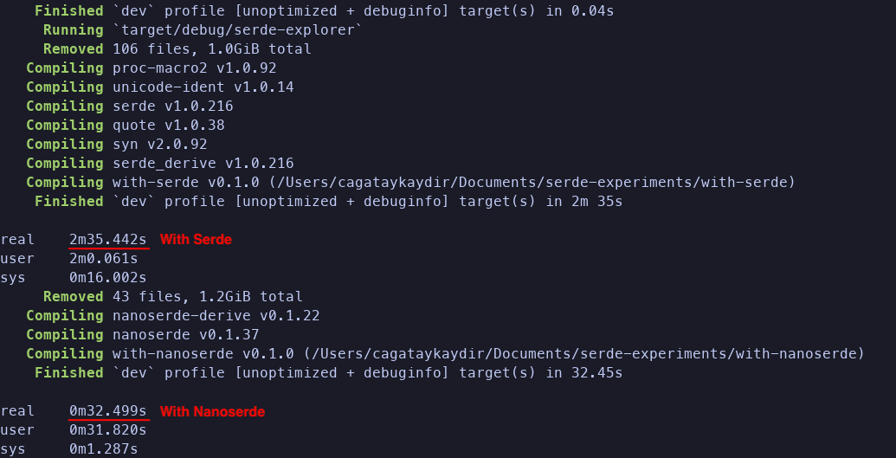

# Serde vs Nanoserde - A Compilation Speed Comparison

This is a small benchmark to compare Serde and Nanoserde at compilation speed, and the difference is a lot, like a lot a lot! In my PC (MacBook Pro M1 16GB RAM 512GB SSD) here are the results:



# How to Run

```bash
./build-test.sh
```

# How to configure

Main code is written in `./benchmark`. Best thing you can change easily is the `function_count`. This sets the number of functions that derive serde/nanoserde serialize and deserialize. Build times depend on this 'lil usize value.
